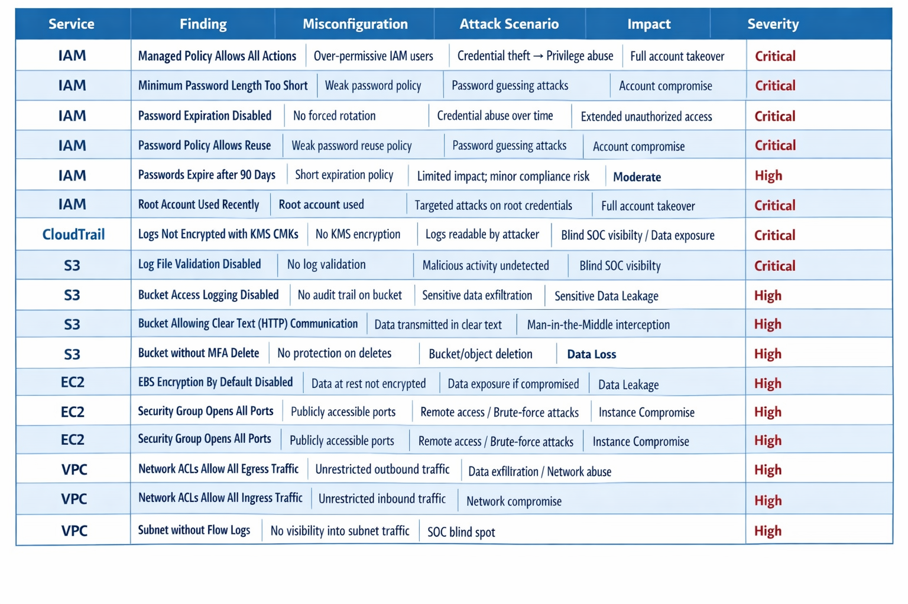
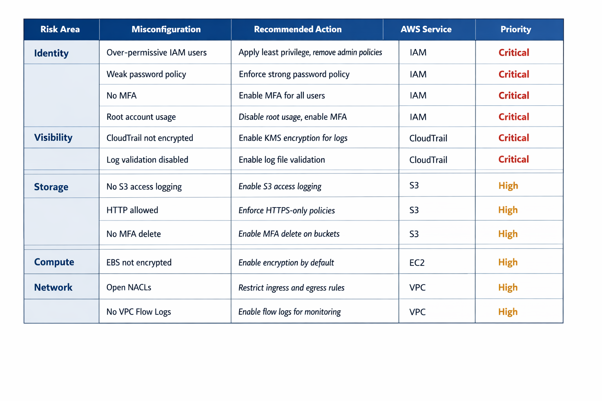
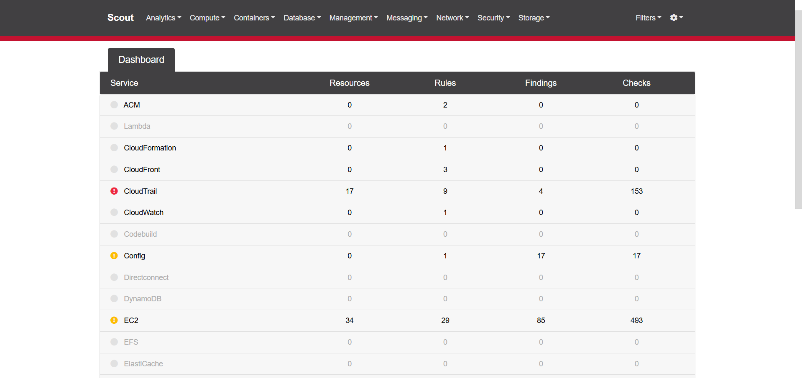

# AWS-Cloud-Security-Posture-Assessment-Using-Scout-Suite
This project demonstrates a real-world cloud security assessment performed on an AWS environment using Scout Suite.

## Project Overview

This project demonstrates a **real-world cloud security assessment** performed on an AWS environment using **Scout Suite**.

The goal was to:

* Identify misconfigurations across AWS services
* Map them to real-world attack scenarios
* Prioritize risks based on exposure
* Design a remediation (hardening) strategy

---

## Tools & Technologies

* AWS (IAM, EC2, S3, VPC, CloudTrail)
* Scout Suite
* AWS CLI
* Python (Virtual Environment)

---

## Task 1: AWS Misconfiguration Scan

### Steps Performed

1. Configured AWS CLI credentials
2. Installed Scout Suite in a virtual environment
3. Executed scan:

```bash
scout aws
```

### Output

* Generated AWS configuration snapshot
* Interactive HTML dashboard
* Identified misconfigurations across services

---

## Task 2: Security Posture Analysis (SOC-Style)

### Key Findings



---

## Task 3: Risk Prioritization & Hardening Strategy

### Remediation Plan



---

## Validation

After implementing fixes:

```bash
scout aws
```

✔ Reduced number of High/Critical findings
✔ Improved overall AWS security posture

---

## Key Learnings

* IAM misconfigurations are the **highest risk** (account takeover)
* Logging (CloudTrail, Flow Logs) is critical for **visibility**
* Network misconfigurations enable **lateral movement**
* Security should be prioritized based on **attack surface, not just compliance**

---

## Outcome

* Identified **critical security gaps**
* Mapped risks to **real-world attack scenarios**
* Built a **prioritized remediation strategy**
* Improved AWS **security posture**

---

## Resume Bullet (Optional)

> Performed AWS security assessment using Scout Suite, identified critical misconfigurations across IAM, S3, EC2, and VPC, mapped risks to attack scenarios, and implemented a prioritized hardening strategy to reduce cloud attack surface.

---

## Future Improvements

* Automate remediation using AWS Config / Lambda
* Integrate findings into SIEM (e.g., Splunk)
* Continuous monitoring with GuardDuty

---

## Conclusion

This project demonstrates a **complete cloud security workflow**:

> **Scan → Analyze → Prioritize → Remediate → Validate**

---
## ScoutSuite Dashboard

